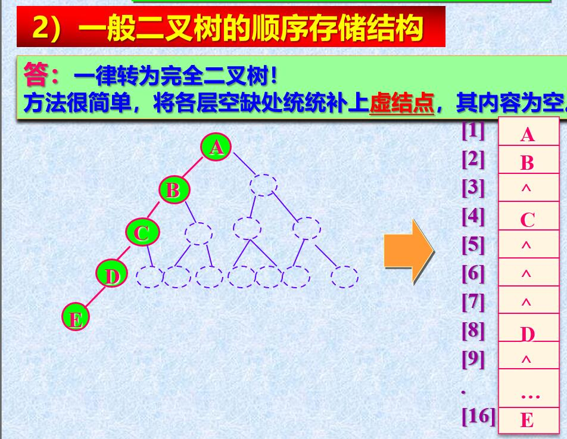
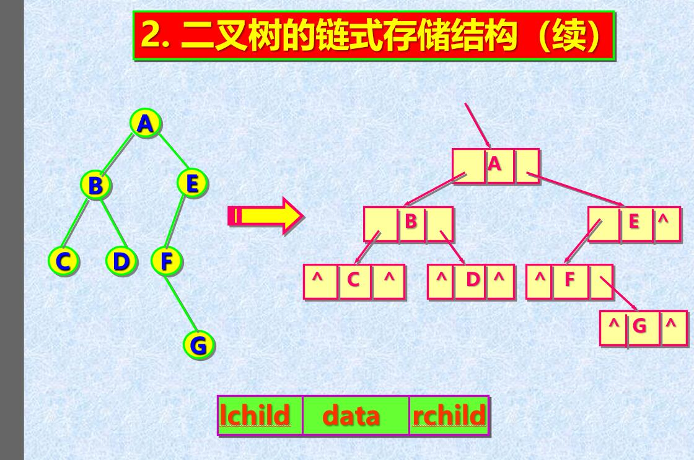

# 04_一对多存储结构小结

## 二叉树概述



二叉树由一个**根节点**加上两个**互不相交**的**左右子树**构成，或者是一个没有结点的空树。

* 每个结点最多有两个子结点。
* 左子树和右子树不可互换，是有序的。

例如，结点A 为根节点，以结点B 为根节点的子树为左子树，以结点C为根节点的子树称为右子树。

>  二叉树的5种基本形态

* 空树
* 只含根节点
* 右子树为空
* 左子树为空
* 左右子树都不为空

> 满二叉树和完全二叉树

* 满二叉树 -->> **每一层都充满结点**

  * 叶子结点只能在最后一层
  * 非叶子结点的度一定是2
  * 在同样深度的二叉树中
  * 满二叉树的结点数最多（因为每个结点都有两个孩子）；
    * 拥有的叶子结点的个数也最多（因为每个结点都有两个孩子，一直到最后一层叶子结点，必然是最多的）；
  * 在相同结点数的树中，满二叉树的深度最小。

  

* 完全二叉树 -->> 最后一层结点可以不满，但必须**集中在左边**。

  * 满二叉树一定是完全二叉树，完全二叉树不一定是满二叉树。
  * 某结点的度如果为1，则它只有**左孩子**。
  * 叶子结点只能出现在**最后两层**。
  * 相同结点的树中，完全二叉树的深度最小。
  
  

> 二叉树的性质

* 性质1

  第 a 层的节点数，至多为 **2^a-1^​**

* 性质2

  深度为 k 的二叉树，节点数至多为 **2^k^ - 1** 个

* 性质3

  若 n~k~ 代表度（孩子个数）为 k 的结点个数，则 n~0~ = n~2~ + 1（**叶子节点数 = 2度结点树 + 1**）

* 性质4

  具有 n 个结点的**完全二叉树**，深度 **k = log~2~n + 1**

* 性质5

  将具有 **n个结点**的**完全二叉树**按照一维数组方式从左到右，从上层到子层，从0开始编号，编号为j的结点

  * 根节点编号为0

  * 左子树根节点为 2j + 1，右子树为 2(j + 1)

  * 判断有子树（即是判断是否有左子树）

    2j + 1 ≤ n - 1，推导出 **2j + 1 < n**

  * 判断左右子树都有（即是判断有右子树）
  
    2(j + 1) ≤ n - 1


> 二叉树的存储方式

* 顺序存储

  将二叉树转换为**完全二叉树**进行存储。

  * 顺序存储的方式缺陷
    * 转换为完全二叉树，浪费空间

    * 新一层数据的插入不方便。

    * 删除非叶子节点不方便。

  

* 链式存储方式

  

## 二叉树的链式表示

* 由于顺序存储方式劣势比较明显，平常用到的表示方式都是链式表示。

> 二叉树的存储结构

* 采用链式存储的方式，结点只存单个元素值，节点之间通过指针联系，维持集合的关系。

* 这里定义了指向父节点的指针，方便从子节点找父节点。

  ```c
  // 定义返回状态及返回码
  #define Status int
  #define OK 1
  #define ERROR 0
  // 定义存储的元素类型
  #define ElementType int
  
  // 二叉树结点结构定义
  typedef struct BinaryTreeNode
  {
  	// 数据域
  	ElementType data;
  	// 指向左孩子的指针
  	BinaryTreeNode* left;
  	// 指向右孩子的指针
  	BinaryTreeNode* right;
  	// 指向父节点的指针
  	BinaryTreeNode* parent;
  }BTNode, *BinaryTree;
  ```

> 二叉树的常用操作

* 初始化

  * 拿到一个指向根结点的指针，即可确定一个二叉树

    ```c
    /* 01_二叉树——初始化*/
    Status initBiTree_T(BinaryTree& biTree)
    {
        biTree = NULL;
        return OK;
    }
    ```

* 销毁

  * 销毁一个二叉树结点是通过指向该结点的指针进行的。

    * 如果结点为空，则不需要进行操作

    * 如果结点不为空，则需要先删除左右孩子结点，再删除该结点

    ```c
    /* 02_二叉树——销毁*/
    Status destroyBiTree_T(BinaryTree& biTree)
    {
        // 如果结点不为空
        if (biTree)
        {
            biTree->parent = NULL;
            // 先删除左右子树
            if (destroyBiTree_T(biTree->left) && destroyBiTree_T(biTree->right))
            {
                return OK;
            }
            // 再删除该结点
            delete biTree;
        }
    	return OK;
    }
    ```
  
* 判空（是否为空树）

  * 即是判断根节点是否为空

    ```c
    /* 03_二叉树——判空*/
    Status emptyBiTree_T(BinaryTree biTree)
    {
        return biTree == NULL ? OK : ERROR;
    }
    ```

* 求深度

  * 利用树的递归，采用累加的方式求得。
  
  * 如果一个结点不为空，则该层的深度为1
  
  * 一个结点的深度，即是其左结点深度，与右节点的深度的较大者，加上本层的深度1。
  
    ```c
    /* 04_二叉树——深度*/
    int treeDepth_T(BinaryTree biTree)
    {
        // 该结点为空，则该层深度为0
        if (!biTree)
        {
            return 0;
        }
        // 否则，该层深度有1，要向上累加
        else
        {
            int leftDepth = treeDepth_T(biTree->left);
            int rightDepth = treeDepth_T(biTree->right);
            // 左右子树的深度，加上本层的深度1，即是该结点的深度
            return 1 + max(leftDepth, rightDepth);
        }
    }
    
    /*返回两个数较大的一个*/
    int max(int a, int b)
    {
        return a > b ? a : b;
    }
    ```
  
* 是否叶子结点

  * 左右孩子都不存在，即是叶子结点

    ```c
    /* 05_二叉树——是否是叶子结点*/
    Status leafBiNode_T(BinaryTree biTree)
    {
        // 左右孩子都不存在，即为叶子结点
        return (biTree->left == NULL && biTree->right == NULL) ? OK : ERROR;
    }
    ```

* 是否根结点

  * 父节点为空

    ```c
    /* 06_二叉树——是否根节点*/
    Status rootBiNode_T(BinaryTree biTree)
    {
        return biTree->parent == NULL ? OK : ERROR;
    }
    ```

* 求父节点

  * 如果当前结点为空或当前结点是根节点，返回空。
  
  * 设置当前结点所存的父节点信息，并返回。
  
    ```c
    /* 06_二叉树——求父节点*/
    Status parentBiNode_T(BinaryTree current, BinaryTree& parent)
    {
        // 如果当前结点为空，或当前结点为根节点
        if (emptyBiTree_T(current) || rootBiNode_T(current))
        {
            parent = NULL;
            return ERROR;
        }
        parent = current->parent;
        return OK;
    }
    ```

* 深度优先遍历方式

  * 递归的前中后序遍历

    * 递归方式非常简单，注意好控制终止条件，按定义的遍历顺序即可。

    ```c
    /* 08_二叉树——先序遍历_递归*/
    void preOrderTraverse_Recur(BinaryTree biTree)
    {
    	if (!biTree)
    	{
    		return;
    	}
    	visit(biTree);
    	preOrderTraverse_Recur(biTree->left);
    	preOrderTraverse_Recur(biTree->right);
    }
    
    /* 09_二叉树——中序遍历_递归*/
    void inOrderTraverse_Recur(BinaryTree biTree)
    {
    	if (!biTree)
    	{
    		return;
    	}
    	inOrderTraverse_Recur(biTree->left);
    	visit(biTree);
    	inOrderTraverse_Recur(biTree->right);
    }
    
    /* 10_二叉树——后序遍历_递归*/
    void postOrderTraverse_Recur(BinaryTree biTree)
    {
    	if (!biTree)
    	{
    		return;
    	}
    	postOrderTraverse_Recur(biTree->left);
    	postOrderTraverse_Recur(biTree->right);
    	visit(biTree);
    }
    ```

  * 先序遍历_非递归（根 –> 左 --> 右）

    ```c
    /* 12_二叉树——先序遍历_非递归*/
    void preOrderTraverse_NonRecur(BinaryTree biTree)
    {
    	if (!biTree)
    	{
    		return;
    	}
    	// 采用栈存放当前结点的引用，用于左子树遍历完成，找到其右子树
    	SqStack nodeStack;
    	initStack_Sq(nodeStack);
    	BinaryTree popped = NULL;
    
    	// 外层：每一次循环完成一次左分支
    	while (!stackEmpty_Sq(nodeStack) || biTree)
    	{
    		
    		// 对左分支的迭代，是一个访问和压栈的过程
    		while (biTree)
    		{
    			// 先序遍历的关键，优先访问根结点
    			visit(biTree);
    			push_Sq(nodeStack, biTree);
    			// 对左结点的迭代
    			biTree = biTree->left;
    		}
    		// 一次左分支完成
    		if (!stackEmpty_Sq(nodeStack))
    		{
    			// 左分支结束，则将其父结点出栈
    			popped = (BinaryTree)malloc(sizeof(BinaryTreeNode));
    			pop_Sq(nodeStack, popped);
    			// 迭代到待访问的右孩子，下次循环执行访问
    			biTree = popped->right;
    		}
    	}
    	destroyStack_Sq(nodeStack);
    }
    ```

    * 按照先序遍历规则，遇到任意一个非空结点，即优先访问，所以过程为：
      * 访问它；
      * 将它压栈；
      * 迭代其左孩子；
    * 访问完成左孩子，
      * 将栈顶元素（以上的非空结点）出栈；
      * 通过该出栈元素继续迭代其右孩子。
    * 过程控制
      * 将非空的控制放到while循环条件中，所以循环体内不用考虑当前结点的左右孩子非空性质。
      * 入栈的结点是根结点。
      * 内层循环，一次循环表示一次赋值到其左孩子的过程。
      * 外层循环是控制遍历过程。一次循环代表一个结点的左子树的完成过程。以栈的非空性和当前结点的非空性共同决定是否还需继续遍历。

  * 中序遍历_非递归（左 --> 中 --> 右）

    ```c
    /* 13_二叉树——中序遍历_非递归*/
    void inOrderTraverse_NonRecur(BinaryTree biTree)
    {
    	if (!biTree)
    	{
    		return;
    	}
    	SqStack nodeStack;
    	initStack_Sq(nodeStack);
    	BinaryTree popped = NULL;
    
    	while (!stackEmpty_Sq(nodeStack) || biTree)
    	{
    		// 遇到左孩子即压栈
    		while (biTree)
    		{
    			push_Sq(nodeStack, biTree);
    			biTree = biTree->left;
    		}
    		if (!stackEmpty_Sq(nodeStack))
    		{
    			// 左孩子完毕，则栈顶为最后一个左孩子，进行输出
    			popped = (BinaryTree)malloc(sizeof(BinaryTreeNode));
    			pop_Sq(nodeStack, popped);
    			visit(popped);
    			// 继续迭代右子树的左孩子
    			biTree = popped->right;
    		}
    	}
    	destroyStack_Sq(nodeStack);
    }
    ```

    * 按照中序遍历规则，遇到任意非空结点，需要将左子树访问完成才能访问它，所以过程为：
      * 压栈；
      * 迭代其左孩子。
    * 左孩子迭代完成。
      * 栈顶元素为该非空结点，出栈，访问它；
      * 迭代到其右孩子，作为下一个非空结点的迭代。
    * 过程控制
      * 同先序遍历一样，非空的控制放到while循环体条件，循环体内不用考虑非空性。
      * 根据中序的规则，对结点的访问放到迭代完成其左子树之后。

  * 后序遍历 (左 --> 右 --> 中)

    ```c
    /* 14_二叉树——后序遍历_非递归*/
    void postOrderTraverse_NonRecur(BinaryTree biTree)
    {
    	if (!biTree)
    	{
    		return;
    	}
    	// 存任意非空结点的栈
    	SqStack nodeStack;
    	initStack_Sq(nodeStack);
    	push_Sq(nodeStack, biTree);
    	// 标记前一次访问的结点
    	BinaryTree pre = NULL;
    
    	while (!stackEmpty_Sq(nodeStack))
    	{
    		// 获取栈顶元素，不出栈，分两种情况讨论
    		getTop_Sq(nodeStack, biTree);
    		/**
    		 * 第一大类：
    		 * 1. 不存在左右结点；
    		 * 2. 前一次访问的结点不为空，且前一次访问的结点【等于当前结点的左孩子】或【右孩子】
    		 */
    		if ((!biTree->left && !biTree->right)
    			|| (pre != NULL
    				&& (pre == biTree->left || biTree == biTree->right)
    				))
    		{
    			visit(biTree);
    			BinaryTree bt = NULL;
    			pop_Sq(nodeStack, bt);
    			pre = biTree;
    		}
    		// 第二大类情况，有孩子未被访问，先右后左的优先级入栈其孩子
    		else
    		{
    			// 优先入栈右结点
    			if (biTree->right)
    			{
    				push_Sq(nodeStack, biTree->right);
    			}
    			if (biTree->left)
    			{
    				push_Sq(nodeStack, biTree->left);
    			}
    		}
    	}
    }
    ```

    * 规则：遇到任意一个结点，必须优先访问其左子树，其次访问右子树，最后再访问它本身。
    * 难题：对于左右子树的访问，都有访问完成回溯的情况：
      * 对于有左右子树的时候，左子树访问完成的回溯，当前结点不能出栈并访问；
      * 右子树访问完成，才能进行出栈和访问。
      * 需要区分回溯的情况，是从左子树回溯的，还是从右子树回溯的。
    * 情况划分：根据这种规则，将遇到一个非空结点的情况划分如下：
      * 无左右孩子 –> 可立即访问
      * 有孩子，但孩子都访问完成 –> 可立即访问
      * 有孩子未被访问。 –> 不可立即访问
    * 实现方案：
      * 全局设置一个指针，记录上一次被访问的结点。
      * 遇到一个结点
        * 可立即访问 –> 
          * 访问它；
          * 将栈顶出栈，赋值为上一次遍历的结点；
        * 不可立即访问 -> 按优先右子树，再左子树进行压栈，保证左子树的访问在右子树之前。

* 层次遍历（广度优先）

  ```c
  /* 15_二叉树——层次遍历*/
  void breadthTraverse(BinaryTree biTree)
  {
  	if (!biTree)
  	{
  		return;
  	}
  	// 存放子树根结点的队列
  	CircularQueue cq;
  	initQueue_Cq(cq);
  	enqueue_Cq(cq, biTree);
  	// 保存出队列的元素
  	BinaryTree deQueued = NULL;
  
  	while (!queueEmpty_Cq(cq))
  	{
  		// 任何结点都在出队列时候进行访问。
  		dequeue_Cq(cq, deQueued);
  		visit(deQueued);
  		if (deQueued->left)
  		{
  			enqueue_Cq(cq, deQueued->left);
  		}
  		if (deQueued->right)
  		{
  			enqueue_Cq(cq, deQueued->right);
  		}
  	}
  }
  ```

  * 首先将根结点入队列，作为迭代的开始。
  * 迭代的结点永远从队列开始。
  * 从队列中取出一个结点，访问它，并将它的孩子入队列。
  * 最终队列为空，层次遍历完毕。

* 叶子结点个数

  ```c
  /* 16_二叉树——叶子个数*/
  int leafCount_T(BinaryTree biTree)
  {
  	// 遇到空结点，则个数不变
  	if (!biTree)
  	{
  		return 0;
  	}
  	// 没有左右孩子，则它是叶子结点
  	else if (!biTree->left && !biTree->right)
  	{
  		return 1;
  	}
  	// 否则，求它的子树的叶子结点个数
  	else
  	{
  		return leafCount_T(biTree->left) + leafCount_T(biTree->right);
  	}
  }
  ```

  * 当前为空结点，则个数增加 0；
  * 当前非空，无左右孩子，则个数增加 1；
  * 当前非空，有孩子，则叶子个数为其左孩子叶子个数 + 右孩子叶子个数。

* 第 k 层的结点个数

  ```c
  /* 17_二叉树——第k层结点数目*/
  int getKLevel_T(BinaryTree biTree, int k)
  {
  	// 以根结点开始的第 k 层 => 以根结点的子孩子开始的第 k-1 层
  	if (!biTree)
  	{
  		return 0;
  	}
  	// 递归结束条件：1即为当前层级，以当前结点为开始的第一层，即当前根结点，只有1个
  	if (k == 1)
  	{
  		return 1;
  	}
  	return getKLevel_T(biTree->left, k - 1) + getKLevel_T(biTree->right, k - 1);
  }
  ```

  * 以根结点开始的第k层 => 以根结点的孩子开始的第 k - 1层。
  * 注意控制递归终止条件。